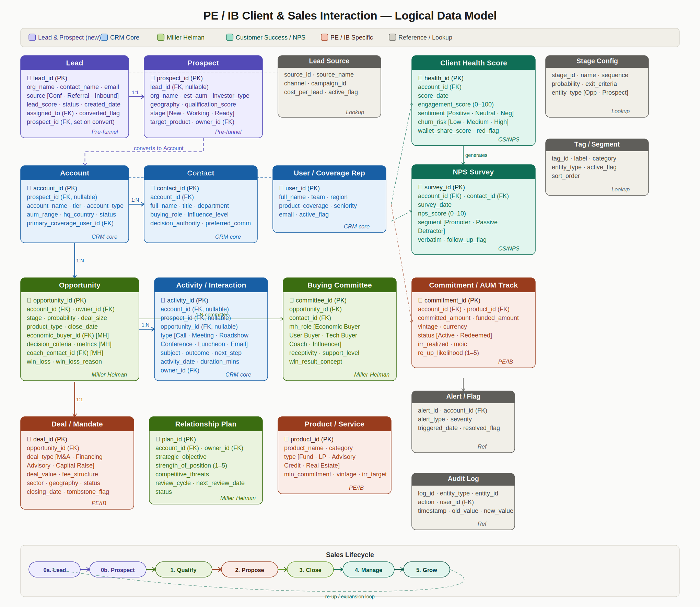

# PE / IB Client & Sales Interaction — Logical Data Model

A logical data model for Private Equity and Investment Banking client relationship management, combining **Salesforce-style CRM entities**, **Miller Heiman Strategic Selling**, and a **Customer Success / NPS lifecycle** into a single coherent schema.

---

## Visual Model



---

## Overview

This model covers the full client journey — from raw lead identification through prospect qualification, account conversion, deal execution, and ongoing relationship management. It is designed for PE and IB firms managing institutional clients such as LPs, sovereign wealth funds, pension funds, family offices, and corporate counterparties.

### Frameworks incorporated

| Framework | Entities |
|---|---|
| **CRM Core** (Salesforce-style) | Account, Contact, Activity / Interaction, User / Coverage Rep |
| **Miller Heiman Strategic Selling** | Opportunity, Buying Committee, Relationship Plan |
| **Customer Success / NPS lifecycle** | Client Health Score, NPS Survey, Alert / Flag |
| **PE / IB specific** | Lead, Prospect, Deal / Mandate, Product / Service, Commitment / AUM Track |
| **Reference / Lookup** | Stage Config, Tag / Segment, Lead Source, Audit Log |

---

## Entities

### Pre-funnel

#### `Lead`
The lightest-weight record in the model. Captures the first signal of a potential relationship before any meaningful research effort is invested.

| Field | Type | Notes |
|---|---|---|
| `lead_id` | UUID | PK |
| `org_name` | VARCHAR | |
| `contact_name` | VARCHAR | |
| `email` | VARCHAR | |
| `source` | ENUM | Conference, Referral, Inbound, Research, Event |
| `source_id` | UUID | FK → Lead Source |
| `lead_score` | INT | 0–100 |
| `status` | ENUM | New, Working, Converted, Disqualified |
| `assigned_to` | UUID | FK → User |
| `created_date` | DATE | |
| `converted_flag` | BOOLEAN | |
| `converted_date` | DATE | |
| `prospect_id` | UUID | FK → Prospect (set on conversion) |

#### `Prospect`
An enriched pre-account record. AUM, investor type, and product fit are profiled here. Activities can be logged against a Prospect before an Account is created, preserving full interaction history on conversion.

| Field | Type | Notes |
|---|---|---|
| `prospect_id` | UUID | PK |
| `lead_id` | UUID | FK → Lead (nullable — a Prospect can be created directly) |
| `org_name` | VARCHAR | |
| `est_aum` | DECIMAL | |
| `aum_currency` | VARCHAR | |
| `investor_type` | ENUM | SWF, Pension, Endowment, Family Office, PE Fund, Corporate |
| `geography` | VARCHAR | |
| `sector_focus` | VARCHAR | |
| `qualification_score` | INT | 0–100 |
| `stage` | ENUM | New, Working, Ready to Convert, Disqualified |
| `target_product` | VARCHAR | |
| `owner_id` | UUID | FK → User |
| `disqualify_reason` | VARCHAR | Preserved for analytics |

---

### CRM Core

#### `Account`
The primary entity for an established client relationship. Carries a nullable `prospect_id` foreign key to preserve conversion lineage for source attribution.

| Field | Type | Notes |
|---|---|---|
| `account_id` | UUID | PK |
| `prospect_id` | UUID | FK → Prospect (nullable) |
| `account_name` | VARCHAR | |
| `account_type` | ENUM | LP, SWF, Corp, PE Fund, Family Office |
| `tier` | ENUM | Tier 1, Tier 2, Tier 3 |
| `aum_range` | VARCHAR | |
| `hq_country` | VARCHAR | |
| `relationship_since` | DATE | |
| `status` | ENUM | Active, Dormant, Former |
| `primary_coverage_user_id` | UUID | FK → User |

#### `Contact`
Individual people within an Account. The `buying_role` and `influence_level` fields map directly to Miller Heiman buying roles.

| Field | Type | Notes |
|---|---|---|
| `contact_id` | UUID | PK |
| `account_id` | UUID | FK → Account |
| `full_name` | VARCHAR | |
| `title` | VARCHAR | |
| `department` | VARCHAR | |
| `buying_role` | ENUM | Economic Buyer, User Buyer, Technical Buyer, Coach, Influencer |
| `influence_level` | ENUM | High, Medium, Low |
| `decision_authority` | ENUM | Final, Recommend, None |
| `linkedin_url` | VARCHAR | |
| `preferred_comm` | ENUM | Email, Phone, In-person |

#### `Activity / Interaction`
All client-facing interactions. The entity accepts three nullable FKs — `account_id`, `prospect_id`, and `opportunity_id` — so activities can be logged at any stage of the funnel.

| Field | Type | Notes |
|---|---|---|
| `activity_id` | UUID | PK |
| `account_id` | UUID | FK → Account (nullable) |
| `prospect_id` | UUID | FK → Prospect (nullable) |
| `opportunity_id` | UUID | FK → Opportunity (nullable) |
| `type` | ENUM | Call, Meeting, Email, Roadshow, Conference, Luncheon |
| `subject` | VARCHAR | |
| `outcome` | TEXT | |
| `next_step` | TEXT | |
| `activity_date` | DATE | |
| `duration_mins` | INT | |
| `owner_id` | UUID | FK → User |

#### `User / Coverage Rep`
Internal users — bankers, coverage officers, relationship managers — who own accounts, prospects, and activities.

| Field | Type | Notes |
|---|---|---|
| `user_id` | UUID | PK |
| `full_name` | VARCHAR | |
| `team` | VARCHAR | |
| `region` | VARCHAR | |
| `product_coverage` | VARCHAR | |
| `seniority` | ENUM | Analyst, Associate, VP, Director, MD |
| `email` | VARCHAR | |
| `active_flag` | BOOLEAN | |

---

### Miller Heiman — Strategic Selling

#### `Opportunity`
The core deal-tracking entity. Miller Heiman fields (`economic_buyer_id`, `decision_criteria`, `coach_contact_id`) are embedded directly rather than normalised into a separate table, keeping the schema CRM-compatible.

| Field | Type | Notes |
|---|---|---|
| `opportunity_id` | UUID | PK |
| `account_id` | UUID | FK → Account |
| `owner_id` | UUID | FK → User |
| `stage` | ENUM | FK → Stage Config |
| `probability` | INT | 0–100 |
| `deal_size` | DECIMAL | |
| `product_type` | VARCHAR | |
| `close_date` | DATE | |
| `economic_buyer_id` | UUID | FK → Contact [MH] |
| `decision_criteria` | TEXT | [MH] |
| `metrics` | TEXT | Measurable results expected [MH] |
| `coach_contact_id` | UUID | FK → Contact [MH] |
| `competition` | TEXT | |
| `win_loss` | ENUM | Won, Lost, No Decision |
| `win_loss_reason` | VARCHAR | |

#### `Buying Committee`
Junction table mapping Contacts to Opportunities with Miller Heiman roles. Each row is one person in one deal's buying committee.

| Field | Type | Notes |
|---|---|---|
| `committee_id` | UUID | PK |
| `opportunity_id` | UUID | FK → Opportunity |
| `contact_id` | UUID | FK → Contact |
| `mh_role` | ENUM | Economic Buyer, User Buyer, Technical Buyer, Coach, Influencer |
| `receptivity` | ENUM | Growth, Trouble, Even Keel, Overconfident |
| `support_level` | ENUM | Strongly For, For, Neutral, Against |
| `win_result_concept` | TEXT | What this person personally gains |

#### `Relationship Plan`
One active strategic plan per major Account, reviewed on a defined cycle. Maps to the Miller Heiman Account Strategy concept.

| Field | Type | Notes |
|---|---|---|
| `plan_id` | UUID | PK |
| `account_id` | UUID | FK → Account |
| `owner_id` | UUID | FK → User |
| `strategic_objective` | TEXT | |
| `strength_of_position` | INT | 1–5 |
| `competitive_threats` | TEXT | |
| `review_cycle` | ENUM | Monthly, Quarterly, Biannual |
| `next_review_date` | DATE | |
| `status` | ENUM | Active, Archived |

---

### PE / IB Specific

#### `Deal / Mandate`
Created when an Opportunity closes. Captures deal economics, sector, and post-close tombstone data.

| Field | Type | Notes |
|---|---|---|
| `deal_id` | UUID | PK |
| `opportunity_id` | UUID | FK → Opportunity |
| `deal_type` | ENUM | M&A, Financing, Advisory, Capital Raise |
| `deal_value` | DECIMAL | |
| `currency` | VARCHAR | |
| `fee_structure` | TEXT | |
| `retainer` | DECIMAL | |
| `sector` | VARCHAR | |
| `geography` | VARCHAR | |
| `status` | ENUM | Active, Closed, Withdrawn |
| `closing_date` | DATE | |
| `tombstone_flag` | BOOLEAN | Approved for publication |

#### `Product / Service`
The firm's product catalog — funds, advisory mandates, credit products, and real estate strategies.

| Field | Type | Notes |
|---|---|---|
| `product_id` | UUID | PK |
| `product_name` | VARCHAR | |
| `category` | VARCHAR | |
| `product_type` | ENUM | Fund, LP, Advisory, Credit, Real Estate |
| `min_commitment` | DECIMAL | |
| `currency` | VARCHAR | |
| `vintage` | INT | Year |
| `target_irr` | DECIMAL | |
| `active_flag` | BOOLEAN | |

#### `Commitment / AUM Track`
Tracks LP commitments per fund per vintage. Enables wallet share analysis and re-up likelihood scoring.

| Field | Type | Notes |
|---|---|---|
| `commitment_id` | UUID | PK |
| `account_id` | UUID | FK → Account |
| `product_id` | UUID | FK → Product / Service |
| `committed_amount` | DECIMAL | |
| `funded_amount` | DECIMAL | |
| `vintage` | INT | |
| `currency` | VARCHAR | |
| `status` | ENUM | Active, Redeemed, Defaulted |
| `irr_realized` | DECIMAL | |
| `moic` | DECIMAL | |
| `re_up_likelihood` | INT | 1–5 |

---

### Customer Success / NPS Lifecycle

#### `Client Health Score`
Snapshotted periodically per Account. Storing snapshots (rather than a single live score) preserves trend data for analysis.

| Field | Type | Notes |
|---|---|---|
| `health_id` | UUID | PK |
| `account_id` | UUID | FK → Account |
| `score_date` | DATE | |
| `engagement_score` | INT | 0–100 |
| `sentiment` | ENUM | Positive, Neutral, Negative |
| `churn_risk` | ENUM | Low, Medium, High |
| `wallet_share_score` | INT | 0–100 |
| `red_flag` | BOOLEAN | Triggers Alert if true |

#### `NPS Survey`
Individual survey responses linked to both Account and Contact for closed-loop tracking.

| Field | Type | Notes |
|---|---|---|
| `survey_id` | UUID | PK |
| `account_id` | UUID | FK → Account |
| `contact_id` | UUID | FK → Contact |
| `survey_date` | DATE | |
| `nps_score` | INT | 0–10 |
| `segment` | ENUM | Promoter (9–10), Passive (7–8), Detractor (0–6) |
| `verbatim` | TEXT | |
| `follow_up_flag` | BOOLEAN | |
| `closed_loop_date` | DATE | Date follow-up was completed |

---

### Reference / Lookup

#### `Alert / Flag`
Auto-generated when a Client Health Score triggers a `red_flag`. Routed to the coverage rep for action.

| Field | Type | Notes |
|---|---|---|
| `alert_id` | UUID | PK |
| `account_id` | UUID | FK → Account |
| `alert_type` | ENUM | Health, NPS, Re-up Risk, Inactivity |
| `severity` | ENUM | Low, Medium, High, Critical |
| `triggered_date` | DATE | |
| `resolved_flag` | BOOLEAN | |
| `resolved_date` | DATE | |

#### `Stage Config`
Lookup table for pipeline stage definitions. Supports both Opportunity and Prospect stages.

| Field | Type | Notes |
|---|---|---|
| `stage_id` | UUID | PK |
| `name` | VARCHAR | |
| `sequence` | INT | Sort order |
| `probability` | INT | Default win probability % |
| `exit_criteria` | TEXT | |
| `entity_type` | ENUM | Opportunity, Prospect |

#### `Audit Log`
Immutable record of all create / update / delete operations across the model. Required for regulatory compliance in IB/PE.

| Field | Type | Notes |
|---|---|---|
| `log_id` | UUID | PK |
| `entity_type` | VARCHAR | Table name |
| `entity_id` | UUID | PK of affected record |
| `action` | ENUM | CREATE, UPDATE, DELETE |
| `user_id` | UUID | FK → User |
| `timestamp` | TIMESTAMP | UTC |
| `old_value` | JSONB | State before change |
| `new_value` | JSONB | State after change |

---

## Relationships

### Pre-funnel

| From | Cardinality | To | Notes |
|---|---|---|---|
| Lead | 1:1 | Prospect | Qualifies into a Prospect |
| Prospect | 1:1 | Account | Converts to Account on approval |
| Prospect | 1:N | Activity | Pre-account interactions logged here |
| Lead / Prospect | N:1 | Lead Source | Attribution chain |
| Lead / Prospect | N:1 | User | Coverage assigned from day one |

### CRM Core

| From | Cardinality | To | Notes |
|---|---|---|---|
| Account | 1:N | Contact | Multiple buying committee members |
| Account | 1:N | Activity | All post-conversion interactions |
| Account | 1:N | Opportunity | Multiple live mandates |
| User | M:N | Account | Via Coverage junction (lead + secondary) |
| Contact | M:N | Activity | Via Activity_Contact junction |

### Miller Heiman

| From | Cardinality | To | Notes |
|---|---|---|---|
| Opportunity | 1:N | Buying Committee | One row per contact per role |
| Opportunity | 1:1 | Deal / Mandate | Converts on close |
| Account | 1:1 | Relationship Plan | One active plan per strategic account |
| Relationship Plan | 1:N | Activity | Planned touchpoints tracked |

### Customer Success / NPS

| From | Cardinality | To | Notes |
|---|---|---|---|
| Account | 1:N | Client Health Score | Snapshotted per period |
| Account | 1:N | NPS Survey | Periodic NPS waves |
| Contact | 1:N | NPS Survey | Individual respondent tracking |
| Client Health Score | N:1 | Alert / Flag | Red flags auto-generate alerts |

### PE / IB Specific

| From | Cardinality | To | Notes |
|---|---|---|---|
| Account | 1:N | Commitment / AUM Track | Per fund, per vintage |
| Opportunity | M:N | Product / Service | Via Opp_Product junction |
| Deal / Mandate | 1:N | Activity | Deal workstream meetings |

---

## Sales Lifecycle

```
0a. Lead → 0b. Prospect → 1. Qualify → 2. Propose → 3. Close → 4. Manage → 5. Grow
                                                                        ↑                    |
                                                                        └────────────────────┘
                                                                           re-up / expansion loop
```

| Stage | Key entities active | Framework |
|---|---|---|
| **0a. Lead** | Lead, Lead Source, User | Pre-funnel |
| **0b. Prospect** | Prospect, Activity, User | Pre-funnel |
| **1. Qualify** | Account, Opportunity, Buying Committee | CRM + Miller Heiman |
| **2. Propose** | Opportunity, Activity, Product / Service | CRM + Miller Heiman + PE/IB |
| **3. Close** | Deal / Mandate, Commitment / AUM Track, Audit Log | PE/IB |
| **4. Manage** | Client Health Score, NPS Survey, Relationship Plan, Alert / Flag | CS/NPS + Miller Heiman |
| **5. Grow** | Opportunity (re-up), Commitment / AUM Track, Activity | PE/IB |

---

## Key Metrics

The model supports the following KPIs across the full funnel:

- Lead-to-prospect conversion rate
- Prospect-to-account conversion rate
- Time-in-stage per funnel level
- Source attribution — which channels generate highest-quality prospects
- Qualification score distribution by investor type and geography
- Activities per prospect before conversion
- Disqualification reason frequency
- Pipeline coverage ratio by stage and product type
- Buying committee coverage score per opportunity (Miller Heiman)
- Win / loss rate by deal type, sector, and coverage team
- NPS trend by account tier and client segment
- Client health score trajectory — red flag rate by coverage team
- Wallet share and re-up likelihood by LP
- AUM track — committed vs funded vs realised by vintage

---

## Design Decisions

**Lead is separate from Prospect.** A Lead is the cheapest record to create — just enough to route and score an initial signal. Merging Lead and Prospect into one entity forces every Conference badge scan into a qualification workflow before any research is done. Keeping them separate preserves operational speed at the top of the funnel.

**Prospect carries a nullable `lead_id`.** Some prospects are created directly (e.g. from a proprietary target list) with no Lead antecedent. The FK is nullable to support both paths while still preserving the Lead → Prospect lineage when it exists.

**Account carries `prospect_id` as a nullable FK.** This is the conversion lineage anchor. It allows source attribution queries to run backward from any Account to the original Lead and campaign that generated it.

**Activity accepts three nullable FKs** (`account_id`, `prospect_id`, `opportunity_id`). This means a single entity handles the full spectrum — from a first outbound call logged against a Prospect, to a deal-specific legal meeting logged against an Opportunity — without requiring separate activity tables per stage.

**Opportunity embeds Miller Heiman fields directly.** Fields like `economic_buyer_id`, `decision_criteria`, and `coach_contact_id` sit on the Opportunity table rather than a separate MH-specific table. This keeps the schema compatible with Salesforce-style CRM implementations where Opportunity is the central deal object.

**Client Health Score is snapshotted, not live.** A single `current_score` field on Account would be overwritten each period and lose history. A snapshot table allows trend analysis, cohort comparison, and regression detection over time.

**Audit Log is append-only.** No `UPDATE` or `DELETE` operations are permitted on the Audit Log table. This is a hard requirement for regulatory compliance in IB and PE environments.

---

## Entity Count Summary

| Domain | Entities |
|---|---|
| Pre-funnel | Lead, Prospect |
| CRM Core | Account, Contact, Activity, User |
| Miller Heiman | Opportunity, Buying Committee, Relationship Plan |
| PE / IB Specific | Deal / Mandate, Product / Service, Commitment / AUM Track |
| Customer Success / NPS | Client Health Score, NPS Survey, Alert / Flag |
| Reference / Lookup | Stage Config, Tag / Segment, Lead Source, Audit Log |
| **Total** | **15 entities** |

---

*Model version 2.0 — includes Lead and Prospect pre-funnel entities.*
